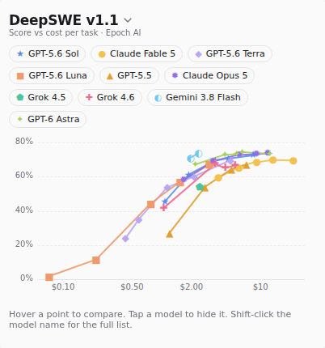

# model-bench

Paseo plugin. It turns the model picker into a score vs cost chart, so you can see what you're actually paying for before you switch models.



Each line is one model from your chat's provider. Each point on it is a reasoning effort (low, medium, high, etc). Hover a point to see its score and cost, then hit Use model and the chat switches to that model and effort.

## benchmarks

Pick one from the title dropdown. Your pick sticks.

- Terminal-Bench 4.0 (default)
- AA Intelligence Index
- DeepSWE v1.1
- ARC-AGI-2
- CursorBench
- FrontierSWE
- WeirdML
- ProofBench

Terminal-Bench 4.0 and the AA Intelligence Index come from [Artificial Analysis](https://artificialanalysis.ai/models). They run every reasoning effort for most big models, which is why Terminal-Bench is the default. They dont have a public API without a key, so the plugin reads the data embedded in one of their model pages. If they redesign that page, those two go empty and the rest keep working. ARC-AGI-2 comes from ARC Prize's public leaderboard files. Everything else comes from [Epoch AI's benchmark data](https://epoch.ai/benchmarks) (CC BY 4.0). No API keys needed. The plugin downloads all of it on the daemon and refreshes them every hour.

Not every model gets run on every benchmark, and results without a published cost get dropped. So if a model you care about is missing, thats usually why.

## how it works

- On desktop and web, clicking the model name or the thinking level in the composer opens the chart right where the dropdown would've been. Shift-click still gets you the normal dropdown.
- On mobile it's a Bench pill above the composer instead. Plugins cant replace built-in controls, so the desktop takeover is a click intercept on Paseo's own test IDs. If Paseo renames those, you just get the normal dropdowns back.
- Models without results on the current benchmark are still one click away. Hit the list icon in the header (or "All N models" under the chart) to see every model in your picker, pick an effort, and use it.
- New workspaces dont have an agent yet, so there the normal picker opens like usual.
- Click a model chip in the legend to hide it. The chart rescales to whatever is left, and hidden models are remembered on the daemon.
- Switching models goes through the daemon's websocket, same as the CLI, since the plugin SDK doesnt have a model setter yet. If your daemon has a password, set `PASEO_PASSWORD` on the daemon.

## install

Needs Paseo 0.8 or later with plugins turned on (Settings -> Plugins).

```bash
paseo plugin add AStox/paseo-model-bench
```

From a checkout:

```bash
npm install
npm run typecheck
paseo plugin install /absolute/path/to/paseo-model-bench
```

After editing source, `paseo plugin reload model-bench`.
